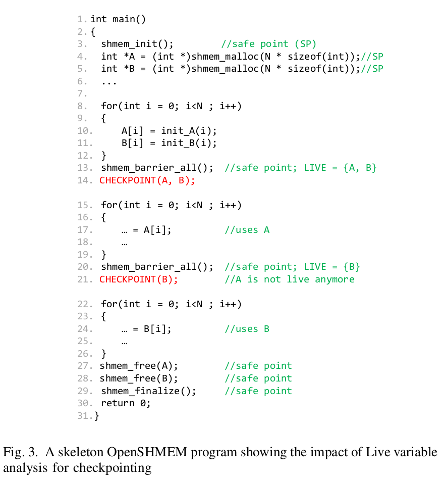

# Checkpointing OpenSHMEM Programs Using Compiler Analysis
This repository contains the codes for the paper: "Checkpointing OpenSHMEM Programs Using Compiler Analysis", published in 2020 IEEE/ACM 10th Workshop on Fault Tolerance for HPC at eXtreme Scale (FTXS).

*We implement a tool to support the **insertion of checkpoints into OpenSHMEM code**. It utilizes a **compiler liveness analysis to provide checkpointing** suggestions (where to checkpoint, what data to checkpoint) to the OpenSHMEM application developer. The tool is based on an open-source compiler framework, LLVM, which is becoming very popular.*

<p align="center">
  
</p>


### Citation:
If you use this code, please consider citing our work-
```
@inproceedings{bari2020checkpointing,
  title={Checkpointing OpenSHMEM Programs Using Compiler Analysis},
  author={Bari, Md Abdullah Shahneous and Basu, Debasmita and Lu, Wenbin and Curtis, Tony and Chapman, Barbara},
  booktitle={2020 IEEE/ACM 10th Workshop on Fault Tolerance for HPC at eXtreme Scale (FTXS)},
  pages={51--60},
  year={2020},
  organization={IEEE}
}
```
#### Acknowledgements:
- This codebase is modified from the awesome repository [llvm-tutor](https://github.com/banach-space/llvm-tutor).
